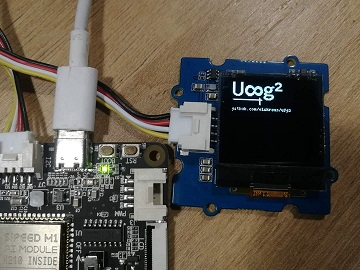
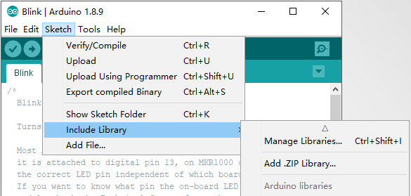
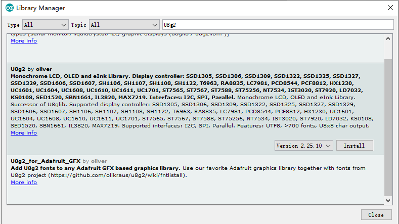
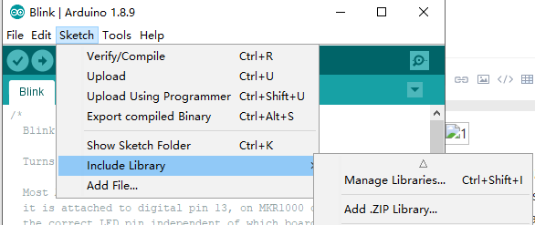
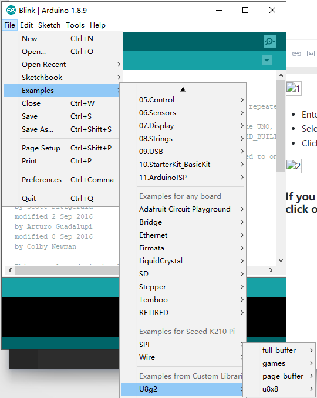
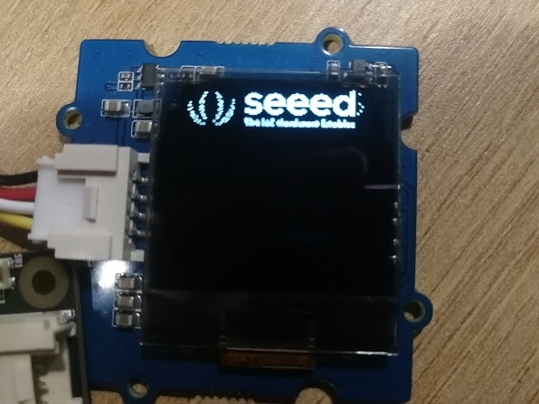
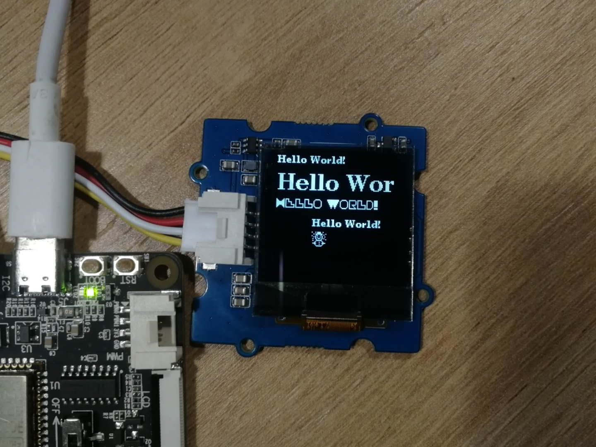

# Overview

U8g2 is a monochrome graphics library for embedded devices. [Provided by Olikraus](https://github.com/olikraus)

&nbsp;&nbsp;&nbsp;&nbsp;&nbsp;&nbsp;&nbsp;&nbsp;&nbsp;&nbsp;&nbsp;&nbsp;&nbsp;&nbsp;&nbsp;&nbsp;&nbsp;&nbsp;&nbsp;&nbsp;&nbsp;&nbsp;&nbsp;&nbsp;&nbsp;&nbsp;&nbsp;&nbsp;&nbsp;

- Supported Display Controller: SSD1305, SSD1306, SSD1309, SSD1322, SSD1325, SSD1327, SSD1329, SSD1606, SSD1607, SH1106, SH1107, SH1108, SH1122, T6963, RA8835, LC7981, PCD8544, PCF8812, HX1230, UC1601, UC1604, UC1608, UC1610, UC1611, UC1701, ST7565, ST7567, ST7588, ST75256, NT7534, IST3020, ST7920, LD7032, KS0108, SED1520, SBN1661, IL3820, MAX7219 (see here for a full list)

U8g2 also includes U8x8 library. Features for U8g2 and U8x8 are:

- U8g2
  Includes all graphics procedures (line/box/circle draw).
  Supports many fonts. (Almost) no restriction on the font height.
  Requires some memory in the microcontroller to render the display.
- U8x8
  Text output only (character) device.
  Only fonts allowed with fixed size per character (8x8 pixel).
  Writes directly to the display. No buffer in the microcontroller required.
  There is one more class/sub-library "U8log", which emulates an output terminal (like Arduino serial monitor): U8log Reference Manual

------

### Install U8g2

#### The Arduino library U8g2 can be installed from the library manager of the Arduino IDE.

- Open Arduino IDE
- Open the Library Manager (Sketch > Include Library > manage Libraries...)



- Enter "u8g2" into the search field
- Select latest version
- Click "Install" button



#### If you want to use the latest U8g2 library, click on the link: [U8g2_Arduino](https://github.com/olikraus/U8g2_Arduino)

- Open Arduino IDE
- Open the Library Manager (Sketch > Include Library > Add .ZIP Library...).
- Select the most recently downloaded U8g2 library.
  

#### The U8g2 library can be seen in Examples after successful installation




# How to connect a display to U8g2 Library?

### Identify the display

You need to know the controller and the size of your display (Note: "Controllerless" displays are not supported by U8g2). In this example, we will use a Seeed_128x128 128x64 display, and  K210 Pi as controller.

For U8g2 you have to select a matching constructor for the correct initialization of the display. Select a constructor from this page: [C++ Setup/Arduino Constructor List.](https://github.com/olikraus/u8g2/wiki/u8g2setupcpp)

### Select a physical bus

Graphics information has to be sent to the display. This information is received by the display controller through a physical bus (usually two or more data lines),
a communication protocol and a command sequence. Often a display supports more than one physical bus. You have to select and setup the correct bus.
Typically the busses are:

- 3SPI, 3-wire SPI: Serial Peripheral Interface with three signals: Clock, Data and Chip-Select.
- 4SPI, 4-Wire SPI: Same as 3SPI, but with one additional line for commands and data (often labeled as D/C, RS or A0)
- I2C, IIC or TWI: Inter-Integrated Circuit Bus which has two signals: Clock (SCL) and Data (SDA).
- 8080: A 8-Bit bus which requires 8 data lines, chip select and a write strobe signal.
- 6800: Another 8-Bit bus, but with a different protocol.

Because Seeed_128X128 display USES I2C as the physical bus, we connect OLED display with K210 PI through I2C.

### U8g2 initialization

U8g2 needs to know which output pin is connected to which input of the display: The pin numbers are provided as list of arguments to the U8g2 constructor. The position within the list is important and indicates the function/purpose of the pin.

From the table here, the constructor has the following template:

```
U8G2_SH1107_SEEED_128X128_F_HW_I2C u8g2(U8G2_R0, /* reset=*/ U8X8_PIN_NONE); 
```

```
U8G2_SH1107_SEEED_128X128_F_SW_I2C u8g2(U8G2_R0, /* clock=*/ SCL, /* data=*/ SDA, /* reset=*/ U8X8_PIN_NONE);
```

The first parameter is the rotation option, the constructor expects the pin number for the clock line(SCL) and the data line(SDA) . The reset line can be provided optionally.If you are using hardware I2C, you do not need to specify SCL and SDA.

**Get more Info:** [U8g2 Setup](https://github.com/olikraus/u8g2/wiki/u8g2setupcpp#buffer-size) 

A complete example will look like this:

```
#include <Arduino.h>
#include <U8g2lib.h>
#include <Wire.h>

U8G2_SH1107_SEEED_128X128_F_HW_I2C u8g2(U8G2_R0, /* clock=*/ SCL, /* data=*/ SDA, /* reset=*/ U8X8_PIN_NONE); //use the hardware I2C.

void setup(void) {
  u8g2.begin();
}

void loop(void) {
  8g2.clearBuffer();					// clear the internal memory
  u8g2.setFont(u8g2_font_ncenB08_tr);	// choose a suitable font
  u8g2.drawStr(0,10,"Hello World!");	// write something to the internal memory
  u8g2.sendBuffer();					// transfer internal memory to the display
  delay(1000);  
}

```

#### Start a U8g2 Arduino project on K210 PI



In order for K210 PI to run the U8g2 library,  must download the latest [K210 PI library](https://github.com/Seeed-Studio/ArduinoCore-k210/tree/dev) and [U8g2 library](https://github.com/olikraus/u8g2). 

In addition, you may get an error prompt of "The command  line is too long" at compile time. You can solve this problem by deleting the.c file in the \src\clib directory for display configuration,and only keep the current display file.

- The format of the display configuration file is: u8x8_d_**display**\_**size**.c.

The bold part is the specific display model and size.

For example, this time we used the following display configuration file is: **u8x8_d_sh1107.c**.


# API Reference

U8g2 library provides a large number of apis for users to use.
The following table shows the most commonly used apis and their descriptions.    

| API                         | Description                                                  |
| :-------------------------- | :----------------------------------------------------------- |
| [begin](#basic)             | start a display.                                             |
| [clear](#basic)             | Clears all pixel on the display and the buffer.              |
| initDisplay                 | Reset and configure the display.                             |
| [sendBuffer](#basic)        | Send the content of the memory frame buffer to the display.  |
| [clearBuffer](#basic)       | Clears all pixel in the memory frame buffer.                 |
| clearDisplay                | Clears all pixel in the internal buffer AND on the connected display. |
| [drawPixel](#basic)         | Draw a pixel at the specified x/y position.                  |
| [drawLine](#basic)          | Draw a line between two points.                              |
| [drawBox](#basic)           | Draw a box (filled frame), starting at x/y position (upper left edge). |
| [drawCircle](#basic)        | Draw a circle with radus rad at position (x0, y0).           |
| [drawDisc](#basic)          | Draw a filled circle with radus rad at position (x0, y0).    |
| [drawEllipse](#basic)       | Draw ellipse with radus rx and 'ry' at position (x0, y0).    |
| [drawFilledEllipse](#basic) | Draw a filled ellipse with radus rx and 'ry' at position (x0, y0). |
| [drawFrame](#basic)         | Draw a frame (empty box), starting at x/y                    |
| [drawTriangle](#basic)      | Draw a triangle (filled polygon)position (upper left edge).  |
| [setFont](#string)          | Define a u8g2 font for the glyph and string drawing functions. |
| [drawGlyph](#string)        | Draw a single character.                                     |
| [drawStr](#string)          | Draw a string. The first character is placed at position x andy. |
| [~~drawBitmap~~](#image)    | Draw a bitmap at the specified x/y position (upper left corner of the bitmap). ==deprecated== |
| [drawXBM](#image)           | Draw a XBM Bitmap. Position (x,y) is the upper left corner of the bitmap. |
| firstPage                   | This command is part of the (picture) loop which renders the content of the display. |
| nextPage                    | This command is part of the (picture) loop which renders the content of the display. |
| setBitmapMode               | Set the bitmap transparent or soild.                         |
| setCursor                   | Define the cursor for the print function. Any output of the print function will start at this position. |
| setDisplayRotation          | Changes the display rotation.                                |

#### More information about U8g2 API can be found [here](https://github.com/olikraus/u8g2/wiki/u8g2reference).

## Demonstration

### Basic

The following shows how to use and display the basic drawing functions provided by U8g2.

#### src 

```c
#include <Arduino.h>
#include <U8g2lib.h>

U8G2_SH1107_SEEED_128X128_F_HW_I2C u8g2(U8G2_R0, /* reset=*/ U8X8_PIN_NONE);


void setup(void) {
  u8g2.begin();  // start a display.
}


//
void drawPixels()
{
  u8g2.clearBuffer();          // clear the internal memory
  for(int i = 0; i < 100; i++){
    // generate 100 points randomly
    u8g2.drawPixel(random(128), random(128)); 
    u8g2.sendBuffer();    
    delay(5); 
  }
}

void drawLines()
{
  u8g2.clearBuffer();          // clear the internal memory
  u8g2.drawLine(0,0, u8g2.getDisplayWidth(), u8g2.getDisplayHeight());
  u8g2.sendBuffer();    
  delay(1000);
  u8g2.drawLine(u8g2.getDisplayWidth(),0, 0, u8g2.getDisplayHeight());
  u8g2.sendBuffer();    
  delay(1000);
  u8g2.drawLine(0, u8g2.getDisplayHeight()/2, u8g2.getDisplayWidth(), u8g2.getDisplayHeight()/2);
  u8g2.sendBuffer();   
  delay(1000);
  u8g2.drawLine(u8g2.getDisplayWidth()/2,0, u8g2.getDisplayWidth()/2, u8g2.getDisplayHeight());
  u8g2.sendBuffer();   
}

void drawBoxes()
{
  u8g2.clearBuffer();          // clear the internal memory
  u8g2.drawBox(0, 0, u8g2.getDisplayWidth()/2-5,u8g2.getDisplayHeight()/2-5);
  u8g2.sendBuffer();    
  delay(1000);
  u8g2.drawBox(0, u8g2.getDisplayHeight()/2+5, u8g2.getDisplayWidth()/2-5,u8g2.getDisplayHeight());
  u8g2.sendBuffer();    
  delay(1000);
  u8g2.drawBox(u8g2.getDisplayWidth()/2+5, u8g2.getDisplayHeight()/2+5, u8g2.getDisplayWidth(),u8g2.getDisplayHeight());
  u8g2.sendBuffer();    
  delay(1000);
  u8g2.drawBox(u8g2.getDisplayWidth()/2+5, 0, u8g2.getDisplayWidth(),u8g2.getDisplayHeight()/2-5);
  u8g2.sendBuffer();    
}

void drawFrames()
{
  u8g2.clearBuffer();          // clear the internal memory
  u8g2.drawFrame(u8g2.getDisplayWidth()/2-10, u8g2.getDisplayHeight()/2-10, 20, 20);
  u8g2.sendBuffer();    
  delay(1000);
  u8g2.drawFrame(u8g2.getDisplayWidth()/2-20, u8g2.getDisplayHeight()/2-20, 40, 40);
  u8g2.sendBuffer();    
  delay(1000);
  u8g2.drawFrame(u8g2.getDisplayWidth()/2-30, u8g2.getDisplayHeight()/2-30, 60, 60);
  u8g2.sendBuffer();    
  delay(1000);
  u8g2.drawFrame(u8g2.getDisplayWidth()/2-40, u8g2.getDisplayHeight()/2-40, 80, 80);
  u8g2.sendBuffer();    
  delay(1000);
  u8g2.drawFrame(u8g2.getDisplayWidth()/2-50, u8g2.getDisplayHeight()/2-50, 100, 100);
  u8g2.sendBuffer();   
}

void drawCircles()
{
   u8g2.clearBuffer();          // clear the internal memory
   u8g2.drawCircle(u8g2.getDisplayWidth()/2, u8g2.getDisplayHeight()/2, 30, U8G2_DRAW_UPPER_RIGHT);
   u8g2.sendBuffer();    
   delay(1000);
   u8g2.drawCircle(u8g2.getDisplayWidth()/2, u8g2.getDisplayHeight()/2, 30, U8G2_DRAW_UPPER_LEFT);
   u8g2.sendBuffer();    
   delay(1000);
   u8g2.drawCircle(u8g2.getDisplayWidth()/2, u8g2.getDisplayHeight()/2, 30, U8G2_DRAW_LOWER_LEFT);
   u8g2.sendBuffer();    
   delay(1000);
   u8g2.drawCircle(u8g2.getDisplayWidth()/2, u8g2.getDisplayHeight()/2, 30, U8G2_DRAW_LOWER_RIGHT);
   u8g2.sendBuffer();    
   delay(1000);
   u8g2.drawCircle(u8g2.getDisplayWidth()/2, u8g2.getDisplayHeight()/2, 50, U8G2_DRAW_ALL);
   u8g2.sendBuffer();    
}

void loop(void) {
 
  drawPixels();
  delay(2000);
  drawLines();
  delay(2000);
  drawFrames();
  delay(2000);
  drawCircles();
  delay(2000);
  drawBoxes();
  delay(2000);
}
```

#### demo

<video src="res/demo_basic.mp4" controls="controls">
</video>

### String

U8g2 provides powerful text output capabilities, it can not only change the size of the output text but also the font format. 

- setFont(const uint8_t *font). [more](https://github.com/olikraus/u8g2/wiki/u8g2reference#setfont)
- drawStr(u8g2_uint_t x, u8g2_uint_t y, const char *s). [more](https://github.com/olikraus/u8g2/wiki/u8g2reference#drawstr)  

#### src

```c
#include <Arduino.h>
#include <U8g2lib.h>

U8G2_SH1107_SEEED_128X128_F_HW_I2C u8g2(U8G2_R0, /* reset=*/ U8X8_PIN_NONE);

void setup(void) {
  u8g2.begin();
}

void loop(void) {
  u8g2.clearBuffer();          // clear the internal memory
  u8g2.setFont(u8g2_font_ncenB08_tr); // choose a suitable font
  u8g2.drawStr(0,10,"Hello World!");  // write something to the internal memory
  u8g2.setFont(u8g2_font_ncenB18_tr); // choose a suitable font
  u8g2.drawStr(0,40,"Hello World!");  // write something to the internal memory
  u8g2.setFont(u8g2_font_pieceofcake_mel_tr); // choose a suitable font
  u8g2.drawStr(0,60,"Hello World!");  // write something to the internal memory
  u8g2.setCursor(40, 80);
  u8g2.setFont(u8g2_font_ncenB08_tr); // choose a suitable font
  u8g2.print("Hello World!");
   u8g2.setFont(u8g2_font_unifont_t_symbols);
  u8g2.drawGlyph(40, 100, 0x2603);
  u8g2.sendBuffer();          // transfer internal memory to the display
  delay(1000);  
}
```

#### demo



### Image

U8g2 library provides two functions to display images.

- ~~drawBitmap()~~(deprecated).
- drawXBM().

In order to display the image on monochrome OLED, we need to convert the image to XBM format. You can convert  online via the WEB, or use any tool you know.


```c
static const unsigned char logo_2018_horizontal_bits[] = {
  0x00, 0x00, 0x00, 0x00, 0x00, 0x00, 0x00, 0x00, 0x00, 0x00, 0x00, 0x00, 
  0x00, 0x00, 0x00, 0x00, 0x00, 0x00, 0x00, 0x00, 0x00, 0x00, 0x00, 0x00, 
  0x00, 0x00, 0x00, 0x00, 0x00, 0x00, 0x00, 0x00, 0x00, 0x00, 0x00, 0x00, 
  0x00, 0x00, 0x00, 0x00, 0x00, 0x00, 0x00, 0x00, 0x00, 0x00, 0x20, 0x00, 
  0x00, 0x00, 0x00, 0x00, 0x00, 0x00, 0x00, 0x00, 0x00, 0x00, 0x00, 0x00, 
  0x00, 0x00, 0x38, 0x00, 0x00, 0x00, 0x00, 0x00, 0x00, 0x00, 0x00, 0x00, 
  0x00, 0x00, 0x00, 0x00, 0x00, 0x00, 0x38, 0x02, 0x00, 0xC0, 0x40, 0x00, 
  0x00, 0x80, 0x02, 0x80, 0x00, 0x40, 0x00, 0x80, 0x00, 0x00, 0x38, 0x00, 
  0x00, 0x00, 0x80, 0x00, 0x00, 0xE0, 0x0F, 0xF8, 0x07, 0xF8, 0x07, 0xF8, 
  0x07, 0xF0, 0x39, 0x00, 0x00, 0x60, 0x00, 0x01, 0x00, 0xF0, 0x3F, 0xFC, 
  0x0F, 0xFC, 0x0F, 0xFC, 0x0F, 0xFC, 0x3B, 0x00, 0x00, 0x20, 0x80, 0x02, 
  0x00, 0x38, 0x18, 0x3E, 0x1E, 0x3E, 0x1E, 0x3E, 0x1F, 0xFE, 0x3F, 0x00, 
  0x00, 0x10, 0x00, 0x00, 0x00, 0x38, 0x00, 0x0E, 0x3C, 0x0F, 0x3C, 0x0F, 
  0x3C, 0x1F, 0x3F, 0x00, 0x00, 0x10, 0x00, 0x01, 0x04, 0x78, 0x00, 0x0F, 
  0x38, 0x0F, 0x38, 0x0F, 0x38, 0x0F, 0x3C, 0x00, 0x00, 0x28, 0x00, 0x06, 
  0x00, 0xF8, 0x07, 0xEF, 0x3F, 0xDF, 0x3F, 0xF7, 0x3F, 0x07, 0x3C, 0x02, 
  0x10, 0x28, 0x00, 0x04, 0x04, 0xF0, 0x1F, 0xFF, 0x3F, 0xFF, 0x3F, 0xFF, 
  0xBF, 0x07, 0x38, 0x00, 0x00, 0x00, 0x00, 0x03, 0x00, 0xC0, 0x3F, 0xFF, 
  0x7F, 0xFF, 0x7F, 0xFF, 0xBF, 0x07, 0x3C, 0x08, 0x18, 0x10, 0x00, 0x06, 
  0x02, 0x00, 0x38, 0x0F, 0x00, 0x07, 0x00, 0x07, 0x00, 0x07, 0x3C, 0x00, 
  0x00, 0x28, 0x00, 0x00, 0x04, 0x00, 0x78, 0x0F, 0x00, 0x0F, 0x00, 0x0F, 
  0x00, 0x0F, 0x3C, 0x00, 0x20, 0x10, 0x00, 0x06, 0x04, 0x38, 0x38, 0x1E, 
  0x0C, 0x1E, 0x0C, 0x1E, 0x0C, 0x1F, 0x3F, 0x04, 0x18, 0x28, 0x00, 0x01, 
  0x01, 0xF8, 0x3F, 0xFC, 0x1F, 0xFC, 0x1F, 0xFC, 0x1F, 0xFE, 0x3F, 0x00, 
  0x00, 0x20, 0x00, 0x04, 0x02, 0xF8, 0x1F, 0xF8, 0x0F, 0xF8, 0x0F, 0xF8, 
  0x1F, 0xFC, 0x3B, 0x01, 0x60, 0x10, 0x00, 0x82, 0x02, 0xC0, 0x07, 0xE0, 
  0x03, 0xE0, 0x03, 0xE0, 0x03, 0xF0, 0x39, 0x00, 0x40, 0x20, 0x00, 0x42, 
  0x02, 0x00, 0x00, 0x00, 0x00, 0x00, 0x00, 0x00, 0x00, 0x00, 0x00, 0x00, 
  0xA0, 0x60, 0x80, 0x40, 0x01, 0x00, 0x00, 0x00, 0x00, 0x00, 0x00, 0x00, 
  0x00, 0x00, 0x00, 0x00, 0x40, 0x02, 0x00, 0x01, 0x00, 0x00, 0x00, 0x00, 
  0x00, 0x00, 0x00, 0x00, 0x00, 0x00, 0x00, 0x00, 0x80, 0xC0, 0x80, 0xB0, 
  0x00, 0x58, 0x80, 0x60, 0x10, 0x40, 0x00, 0x00, 0x03, 0x88, 0x00, 0x00, 
  0x00, 0x02, 0x00, 0x48, 0x00, 0xD8, 0x88, 0x64, 0x14, 0x40, 0x00, 0x10, 
  0x21, 0x88, 0x00, 0x00, 0x00, 0x09, 0x20, 0x28, 0x00, 0x98, 0x95, 0x2A, 
  0xDE, 0x7D, 0xDD, 0x2E, 0x7B, 0xBB, 0x36, 0x00, 0x00, 0x04, 0x00, 0x04, 
  0x00, 0x50, 0x9F, 0x2A, 0xD6, 0x57, 0xAD, 0x3A, 0x91, 0xAB, 0x17, 0x00, 
  0x00, 0x50, 0x80, 0x02, 0x00, 0x50, 0x99, 0x6E, 0xD4, 0x75, 0xEF, 0x1A, 
  0xAF, 0xBB, 0x36, 0x00, 0x00, 0x00, 0x00, 0x00, 0x00, 0x00, 0x00, 0x00, 
  0x00, 0x00, 0x00, 0x00, 0x00, 0x00, 0x00, 0x00, 0x00, 0x00, 0x00, 0x00, 
  0x00, 0x00, 0x00, 0x00, 0x00, 0x00, 0x00, 0x00, 0x00, 0x00, 0x00, 0x00, 
  0x00, 0x00, 0x00, 0x00, 0x00, 0x00, 0x00, 0x00, 0x00, 0x00, 0x00, 0x00, 
  0x00, 0x00, 0x00, 0x00, 0x00, 0x00, 0x00, 0x00, 0x00, 0x00, 0x00, 0x00, 
  0x00, 0x00, 0x00, 0x00, 0x00, 0x00, 0x00, 0x00, };
```

#### src 

```C
void setup(void) {
  u8g2.begin();
  Serial.begin(115200);
}

void loop(void) {
  u8g2.clearBuffer();          // clear the internal memory
  u8g2.drawXBM(0,0, 128, 32, logo_2018_horizontal_bits);
  u8g2.sendBuffer();          // transfer internal memory to the display
  //Serial.println(sizeof(ironman_bits));
  Serial.println("work");
  delay(1000);  
}
```

#### demo


### Performance

According to the kendryte k210 datasheet,  I2C can work in following modes:

- Standard mode (0 to 100Kb/s).
- Fast mode (<= 400Kb/s).

U8g2  Examples include Example of performance testing. 

- Open the example: FPS (File > Examples  > U8g2 > full_buffer > FPS).
- Unccomment the Corresponding  contructor line.

```C
U8G2_SH1107_SEEED_128X128_F_HW_I2C u8g2(U8G2_R0, /* reset=*/ U8X8_PIN_NONE); 
```

- Call u8g2.setBusClock() before the first call to u8g2.begin().  

```c
u8g2.setBusClock(100000); //Set the clock frequency of I2C to 100Khz
```

- Compile and run to see the results.

#### demo

<video src="res/demo_fps_100Khz.mp4" controls="controls">
</video>

We can notice that FPS is around 15，which can meet a large number of application scenarios. 

```c
u8g2.setBusClock(400000); //Set the clock frequency of I2C to 400Khz.
```

#### demo

<video src="res/demo_fps_400Khz.mp4" controls="controls">
</video>

When the working frequency of I2C is in 400Khz mode, the FPS reaches about 25.In practice, I2C frequencies can be even faster, but the CPU may be unstable, so use it with caution.

#### This article demonstrates some of the most common features of the U8g2 library. For more information, click [here](https://github.com/olikraus/u8g2/wiki).
